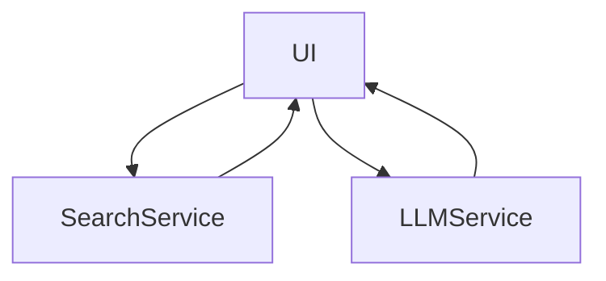

## Introduction

In the world of e-commerce, where competition is growing every day, every detail on a website plays a crucial role in attracting and retaining customers. One such element is the search system. Effective search suggestions not only enhance user experience but also significantly impact conversion rates, turning visitors into buyers.

## Problem Statement
Imagine a situation where a user visits your online store with a specific request, such as "I want sweet" or "I want to order smth for my tea time". However, the standard search system returns a limited number of results or provides no suggestions at all. Traditional search methods often struggle to provide relevant and diverse offerings, negatively affecting conversion metrics.


# Solution with LLM


This is where large language model (LLM) technology, such as GPT, comes to the rescue. We can ask model to **suggest** user **search queries**, to show at least something in scenarios where we have 0 or not enough results from traditional search.

## System Architecture
Let's build a simple system with Streamlit, OpenSearch and LLM.


Our system combines traditional search based on OpenSearch with LLM capabilities to create intelligent search suggestions. The main components of the architecture include:
- **User Interface**: Developed using Streamlit, it provides a convenient platform for user interaction.
- **Search Service**: Utilizes OpenSearch to perform basic search queries.
- **LLM Service**: Generates additional suggestions if traditional search does not provide enough results.



## Example Implementation
Let’s consider an example of integrating LLM to enhance search suggestions. Suppose a user enters the query "I want something sweet." If traditional search returns fewer than 5 suggestions, the system queries the LLM, which generates additional proposals.

**Prompt for LLM**:
```python
f"You are a helpful assistant that helps user to find products in e-commerce store. Generate 5 relevant product suggestions for '{query}'. Return only a JSON array of strings with product names.
```
**Model Response**:
```python
['Chocolate Chip Cookies', 'Assorted Gourmet Candy Box', 'Vanilla Cupcake Mix', 'Chocolate Brownie Bites', 'Caramel Sea Salt Chocolate Bars']
```
These suggestions are then displayed to the user alongside the results from traditional search, creating a more comprehensive and satisfying offering.

# Results and Optimizations
The implementation of LLM for search suggestions led to a 1.1% increase in conversion to purchase. Additional optimizations include:
- **Caching LLM Queries**: Reduces the number of calls to the model and decreases latency.
- **Adjusting Generation Temperature**: Using a value of 0.7-0.9 allows for more diverse and "unusual" suggestions.
- **Visual Highlighting of LLM Suggestions**: Helps users distinguish between standard results and intelligently generated proposals.

# Conclusion
The use of large language models for generating search suggestions opens up new opportunities for enhancing the effectiveness of e-commerce platforms. Intelligent suggestions not only improve user experience but also directly influence sales growth. The implementation of such technologies is becoming increasingly relevant in the face of fierce competition in the e-commerce market.

#️⃣ Created with love by the merkulov.ai team